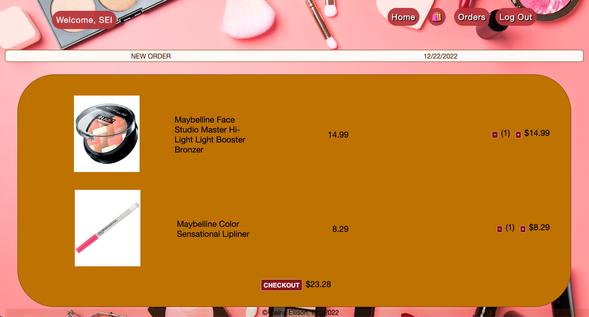

    

### [CLICK TO DEMO](https://maybelline.herokuapp.com/)

## Description 

The Maybelline makeup website, a mockup, offers its customers exclusive products designed to enhance their everyday lives. Explore a range of items, including lipstick, mascara, foundation, and more, that perfectly complement your style as you browse the site.

#

    
:gear: Functionality

        <h3 align="center">Landing Page</h3>
        

        <h3 align="center">Home Page</h3>
        

        <h3 align="center">Cart Page</h3>
        

        <h3 align="center">Order Page</h3>
        

## **Technologies Used:**  

## **Getting Started:**
 <a href="https://trello.com/b/iDKe2Cx9/maybelline">Trello Board</a>  
 <a href="https://maybelline.herokuapp.com/">Deployed Link</a>

## **Next Steps:**  
[ ] Implement a search functionality.

[ ] Create a category section.

[ ] Add an arrow that allows users to go back to the top of the home page.
